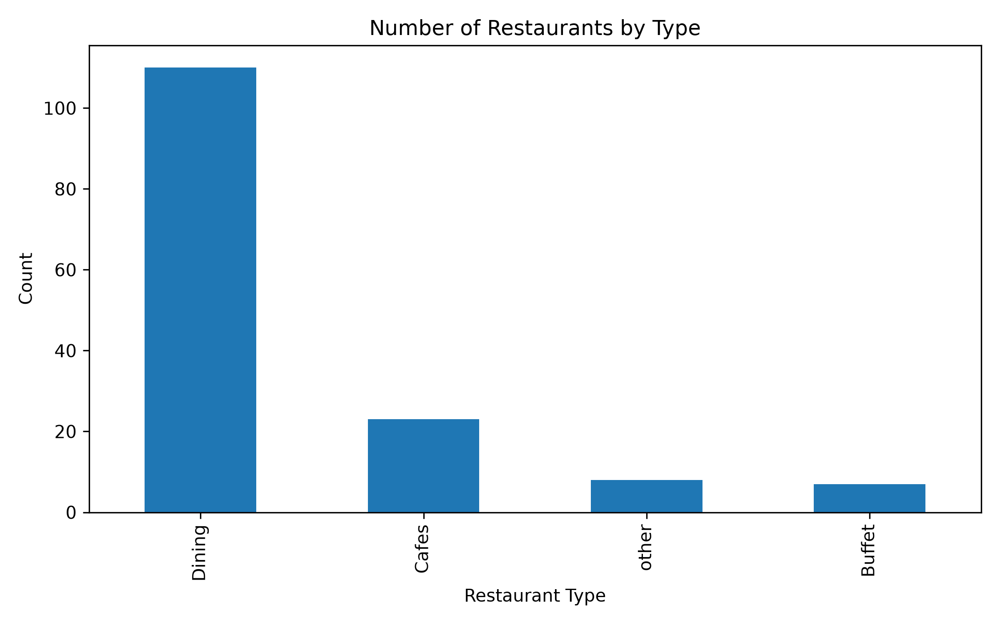
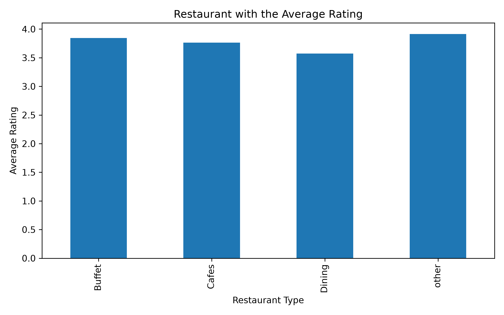
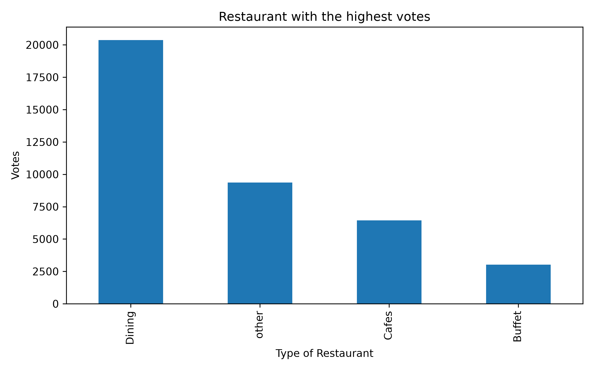
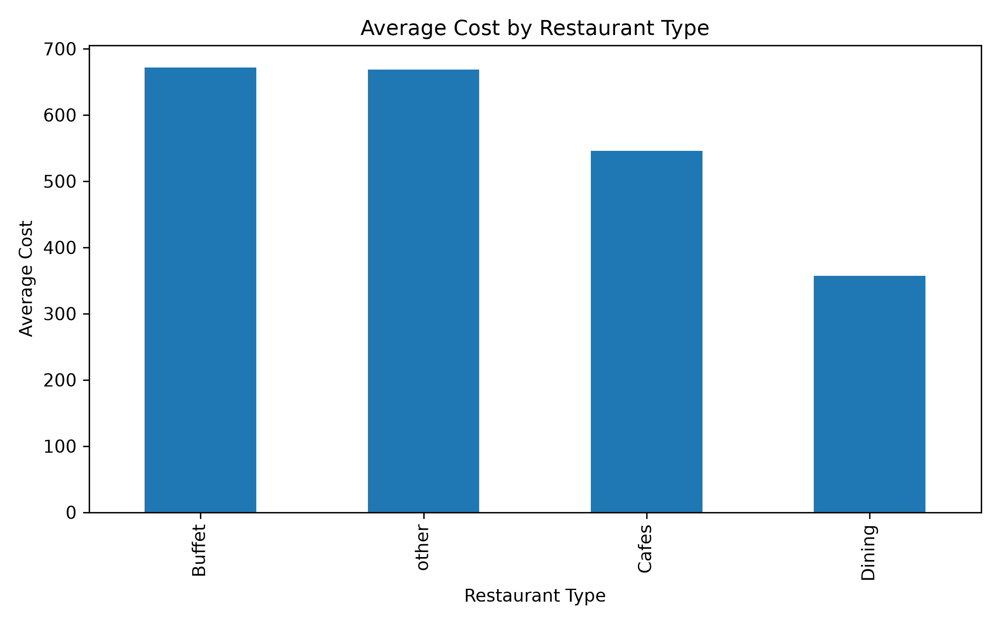
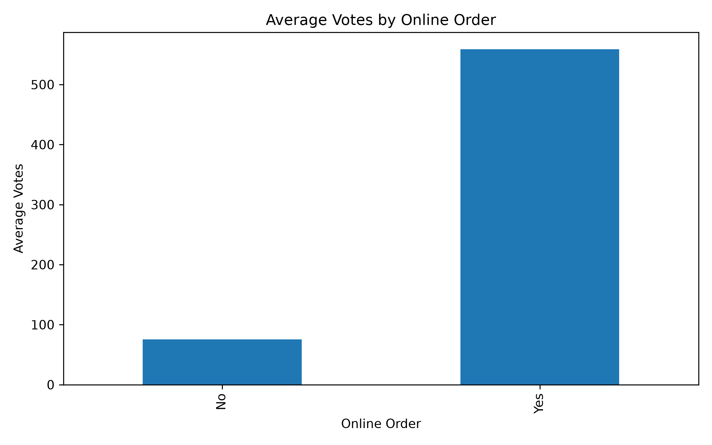
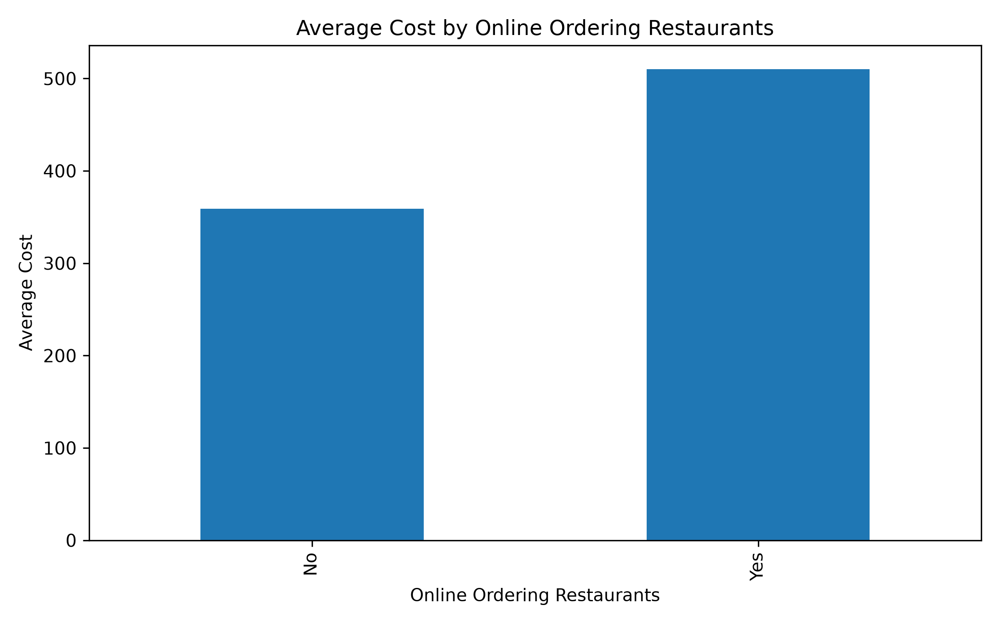
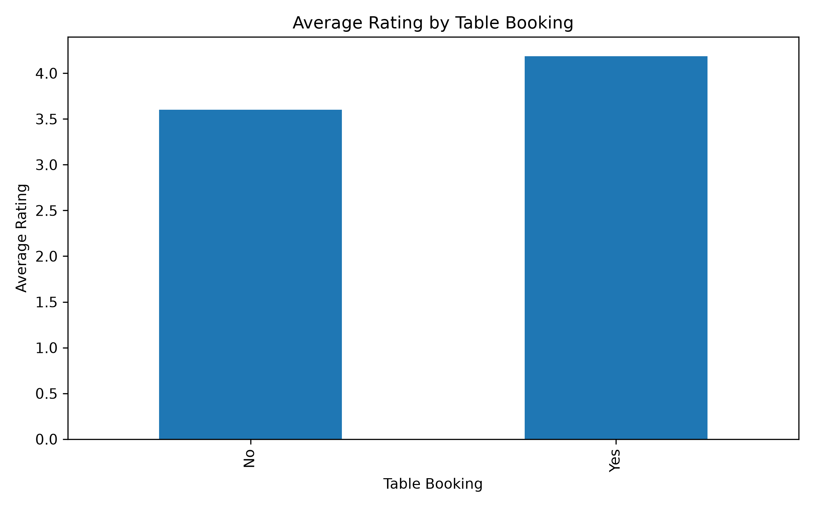
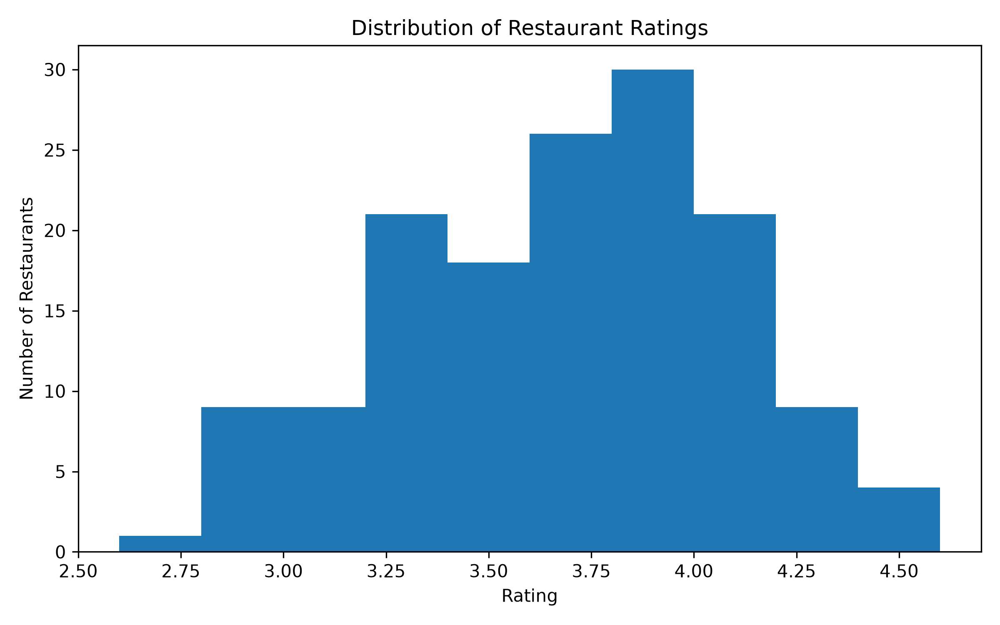
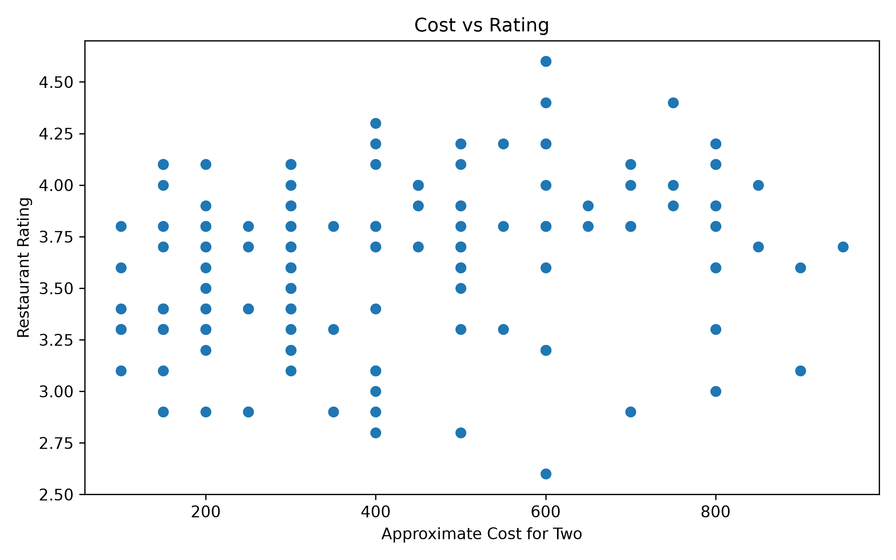
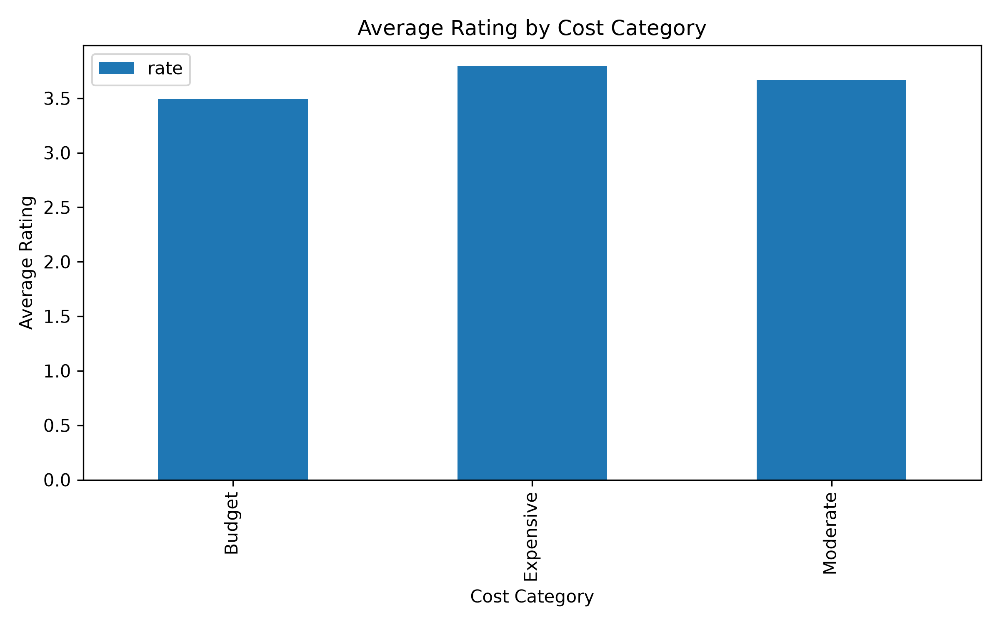

# 🍽️ Zomato Restaurant Data Analysis | Python - Pandas - Matplotlib

## 📌 Project Overview

This project performs **Exploratory Data Analysis (EDA)** on a Zomato restaurant dataset using **Python, Pandas, and Matplotlib**.

The objective is to understand restaurant trends, customer engagement, ratings, pricing, and the impact of online ordering and table booking through data-driven insights and visualizations.

---

## 🎯 Objectives

- Explore and understand the restaurant dataset
- Clean and preprocess the data
- Perform exploratory data analysis (EDA)
- Answer real-world business questions
- Create meaningful visualizations
- Summarize key business insights

---

## 🛠️ Technologies Used

- Python
- Pandas
- Matplotlib

---

## 📂 Dataset Information

The dataset contains **148 restaurant records** with the following columns:

- Restaurant Name
- Online Order Availability
- Table Booking Availability
- Rating
- Votes
- Approximate Cost for Two People
- Restaurant Type

---

## 📊 Business Questions Answered

### 1. Which restaurant type is the most common?

**Insight**

Dining restaurants are the most common restaurant type, while Buffet restaurants represent the smallest portion of the dataset.

---

### 2. Which restaurant type has the highest average rating?

**Insight**

Buffet restaurants have the highest average ratings among all restaurant types.

---

### 3. Which restaurant type receives the highest total votes?

**Insight**

Dining restaurants receive the highest number of customer votes, indicating higher popularity and customer interaction.

---

### 4. Which restaurant type has the highest average cost?

**Insight**

Buffet restaurants have the highest average cost for two people compared to other restaurant categories.

---

### 5. Do restaurants offering online ordering receive more customer engagement?

**Insight**

Restaurants that provide online ordering receive significantly higher average votes, indicating greater customer engagement and visibility.

---

### 6. Do restaurants with online ordering charge more?

**Insight**

Restaurants offering online ordering have a slightly higher average cost compared to restaurants without online ordering.

---

### 7. Does table booking affect restaurant ratings?

**Insight**

Restaurants offering table booking generally receive higher average ratings than those without table booking.

---

### 8. How are restaurant ratings distributed?

**Insight**

Most restaurants are rated between **3.5 and 4.5**, indicating generally positive customer experiences.

---

### 10. Does spending more result in higher ratings?

**Insight**

The correlation between cost and rating is **0.25**, indicating a weak positive relationship. Restaurant price alone is not a strong predictor of customer ratings.

---

### 11. Which cost category has the highest average rating?

**Insight**

Expensive restaurants have the highest average ratings, followed by Moderate and Budget restaurants.

---

# 📈 Feature Engineering

A new feature called **Cost Category** was created based on the approximate cost for two people.

| Cost Range | Category |
|------------|----------|
| Less than ₹300 | Budget |
| ₹300 – ₹700 | Moderate |
| Above ₹700 | Expensive |

---

# 📌 Key Findings

- Dining restaurants dominate the dataset.
- Online ordering significantly increases customer engagement.
- Restaurants with table booking generally receive higher ratings.
- Expensive restaurants tend to have better ratings.
- Restaurant cost has only a weak correlation with customer ratings.
- Most restaurants maintain ratings between **3.5 and 4.5**.

---

# 🚀 Future Improvements

- Build interactive dashboards using Power BI.
- Perform advanced visualizations using Seaborn.
- Analyze larger restaurant datasets.
- Build predictive models for restaurant ratings.

---

# 📷 Sample Visualizations

The complete set of charts is available in the **images/** folder.

---

## 👩‍💻 Author
**Kainat Siddiqui**
Aspiring Data Analyst | Python | SQL | Power BI | Pandas | NumPy | Matplotlib
